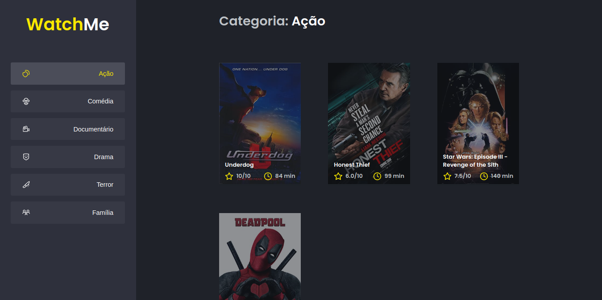
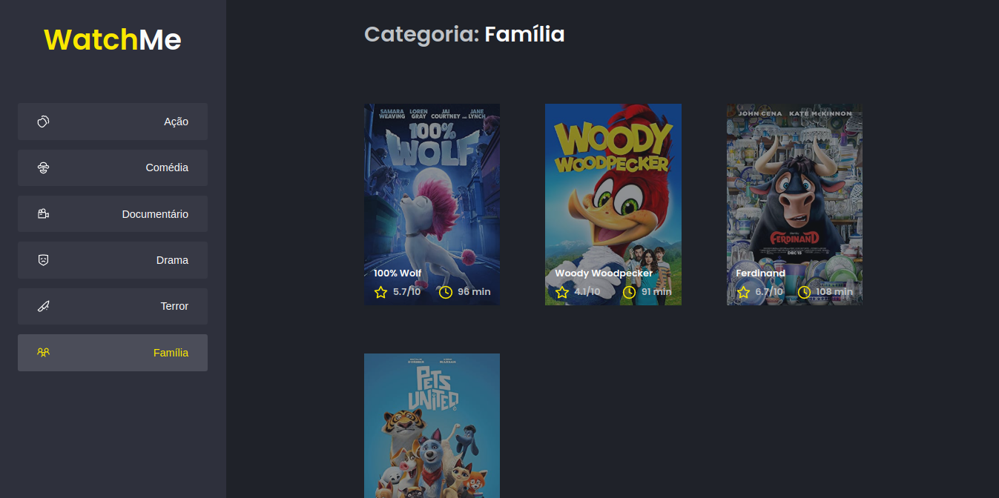

<h4 align="center"> 
	Desafio 02 - WatchMe 
</h4>

<p align="center">
  
  
  
  
  <a href="https://www.linkedin.com/in/paulobeckman/">
    
  </a>
	
  
  <a href="https://github.com/paulobeckman/WatchMe/commits/master">
    
  </a>

  
   <a href="https://github.com/paulobeckman/WatchMe/stargazers">
    
  </a>
</p>
 
 ## 💻 Sobre o projeto

 Essa aplicação foi feita como desafio duarante o curso ignite da rocketseat. E teve como principal objetivo refatorar uma página para listagem de filmes de acordo com gênero. Com isso, na refatoração tive que criar dois novos componentes um chamado de Content responsável pelo header e conteúdo da aplicação e outro chamado de SideBar responsável pela seção que contém o título do site e a parte de navegação à esquerda da página.

 ### Web

<p align="center" style="display: flex; align-items: flex-start; justify-content: center;">
	
  	
		
  

  
</p>

### Pré-requisitos

Antes de começar, você vai precisar ter instalado em sua máquina as seguintes ferramentas:
[Git](https://git-scm.com), [Node.js][nodejs] e o [Yarn][yarn]
Além disto é bom ter um editor para trabalhar com o código como [VSCode][vscode]


### 🎲 Rodando a aplicação web

```bash
# Clone este repositório
$ git clone https://github.com/paulobeckman/WatchMe.git

# Acesse a pasta do projeto no terminal/cmd
$ cd WatchMe

# Instale as dependências
$ yarn

# Execute a aplicação em modo de desenvolvimento
$ yarn dev

# O servidor inciará na porta:8080 - acesse http://localhost:8080 
```


### 🎲 Rodando o servidor fake API com JSON server

```bash
# Acesse a pasta do projeto no terminal/cmd
$ cd WatchMe

# Execute a aplicação em modo de desenvolvimento
$ yarn server

# O servidor inciará na porta:3333 - acesse http://localhost:3333 
```


## 📝 Licença

Este projeto esta sobe a licença MIT. Veja a [LICENÇA](license) para saber mais.

Feito por Paulo Beckman 👋🏽 [Entre em contato!](https://www.linkedin.com/in/paulobeckman/)

[nodejs]: https://nodejs.org/
[yarn]: https://yarnpkg.com/
[vscode]: https://code.visualstudio.com/
[license]: https://opensource.org/licenses/MIT